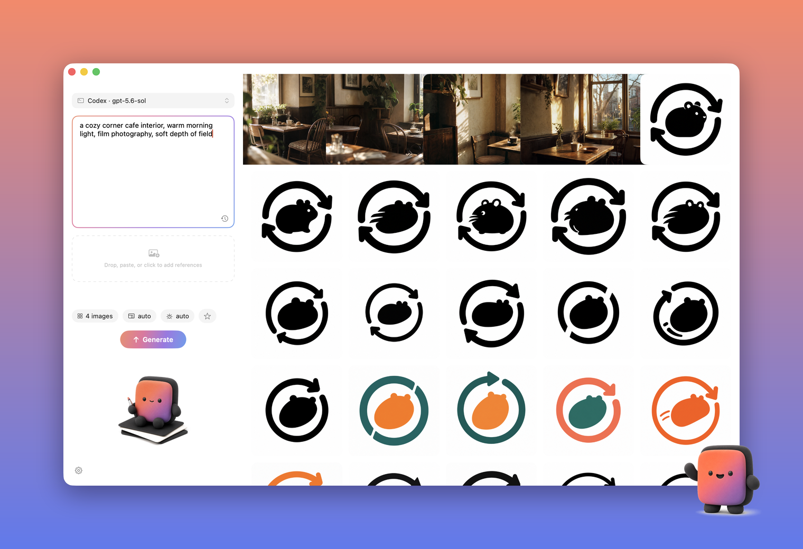

<div align="center">


# Image Studio

**Prompt in, pictures out — a tiny native AI image studio for your Mac.**

[](https://github.com/Suge8/Image-Studio/actions/workflows/ci.yml)


English | [简体中文](README.zh-CN.md)



</div>

## ✨ Why you'll like it

- **Free with what you have** — reuses your local `codex login` (ChatGPT subscription). No extra key, no extra cost.
- **Or bring a key** — any OpenAI-Images-compatible relay works: `gpt-image`, `nano-banana` family, with per-image prices shown before you spend.
- **Truly native** — a 2.4 MB SwiftUI app, zero third-party dependencies, no Electron, no browser tab.
- **Batch by default** — every image is its own parallel request; keep submitting while earlier batches still cook.
- **Your folder is the history** — results land in a folder you pick. Quick Look, drag to Finder, no database, no lock-in.
- **Honest controls** — only sizes each backend actually honors (verified live). No placebo dropdowns.

## 🚀 Get started

**1 · Install** (macOS 15+, Xcode 16+)

```bash
git clone https://github.com/Suge8/Image-Studio.git && cd Image-Studio
make install && make run
```

**2 · Connect a channel** — either one works, switch anytime from the capsule at the top left:

| Channel | Setup |
|---|---|
| **Codex** | Run `codex login` once in Terminal (choose ChatGPT). Done. |
| **Relay** | Settings → Third-party Relay → base URL + API key → *Save & Verify*. Keys live in the macOS Keychain. |

**3 · Generate**

<div align="center"></div>

Type a prompt, press **⌘↩**. Slots stream into the gallery as they finish.

## 🎛️ Good to know

| | |
|---|---|
| Iterate on a result | Right-click → **Use as Reference** |
| Reference images | Drag, paste (**⌘V**), or click the dropzone — up to 16 |
| Reuse prompts | ★ chip for favorites (logo-board template built in), clock icon for history |
| Preview | Select a result, press **Space** for Quick Look |
| Failed slot | Hover → retry just that one |

## 🛠️ Development

```bash
make test       # unit tests
make package    # Release zip → dist/
```

Architecture and design docs live in [`docs/`](docs/); start at [`AGENTS.md`](AGENTS.md). Contributions welcome — see [CONTRIBUTING.md](.github/CONTRIBUTING.md) · [SECURITY.md](.github/SECURITY.md) · [Apache-2.0](LICENSE)
