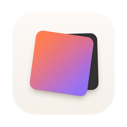
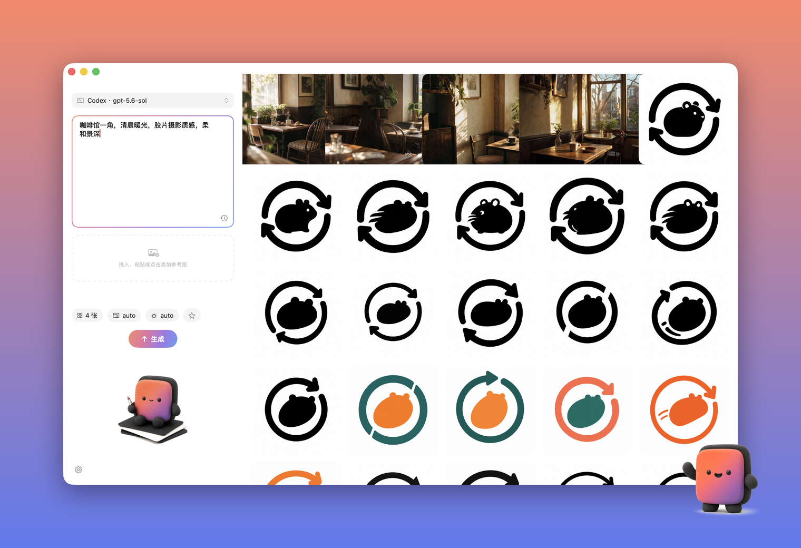
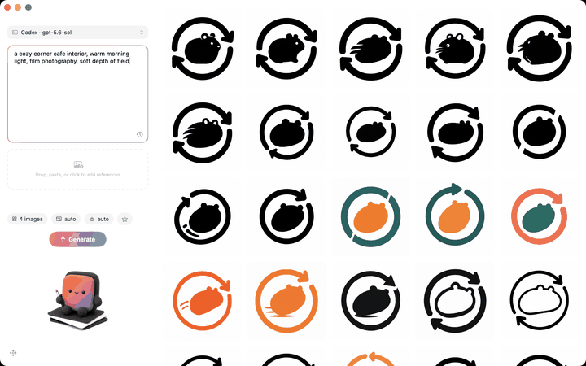

<div align="center">



# Image Studio

macOS 原生小应用，输入一句提示词，批量出图。

[](https://github.com/Suge8/Image-Studio/actions/workflows/ci.yml)


[English](README.md) | 简体中文 | [官网](https://image-studio-orpin.vercel.app)



</div>

## 它做什么

- 复用你本机的 `codex login`（ChatGPT 订阅），不需要额外买 key。
- 也支持任何兼容 OpenAI Images 接口的中转。自带 key，生成前能看到每张图的单价。已实测 `gpt-image` 和 `nano-banana` 系列。
- 2.4 MB 的 SwiftUI 应用，零第三方依赖。
- 每张图一个独立请求。上一批还在生成，下一批可以直接发。
- 结果保存在你选的文件夹里，文件夹就是历史。空格预览、拖进 Finder，没有数据库。
- 尺寸选项只保留后端真正接受的值。我们对着线上接口实测过，删掉了会静默回退的选项。

## 安装

需要 macOS 15+ 和 Xcode 16+。

```bash
git clone https://github.com/Suge8/Image-Studio.git && cd Image-Studio
make install && make run
```

## 接一个通道

任选其一，也可以两个都配。左上角胶囊随时切换。

| 通道 | 配置 |
|---|---|
| **Codex** | 终端跑一次 `codex login`，选 ChatGPT。 |
| **中转** | 设置 → 第三方中转 → 填 Base URL 和 API Key → 保存并检查。Key 存在 macOS 钥匙串。 |

## 生成

<div align="center"></div>

输入提示词，按 **⌘↩**。图片完成一张，画廊进一张。

## 技巧

| | |
|---|---|
| 基于结果迭代 | 右键 → **用作参考图** |
| 加参考图 | 拖入、粘贴（**⌘V**）或点击虚线框，最多 16 张 |
| 复用提示词 | ★ 收藏（内置 Logo 提案板模板），时钟图标看历史 |
| 预览 | 选中图片按 **空格** |
| 单张失败 | 悬停它，只重试这一张 |

## 开发

```bash
make test       # 单元测试
make package    # Release 打包 → dist/
```

架构与设计文档在 [`docs/`](docs/)，从 [`AGENTS.md`](AGENTS.md) 开始。欢迎贡献：[CONTRIBUTING.md](.github/CONTRIBUTING.md) · [SECURITY.md](.github/SECURITY.md) · [Apache-2.0](LICENSE)
