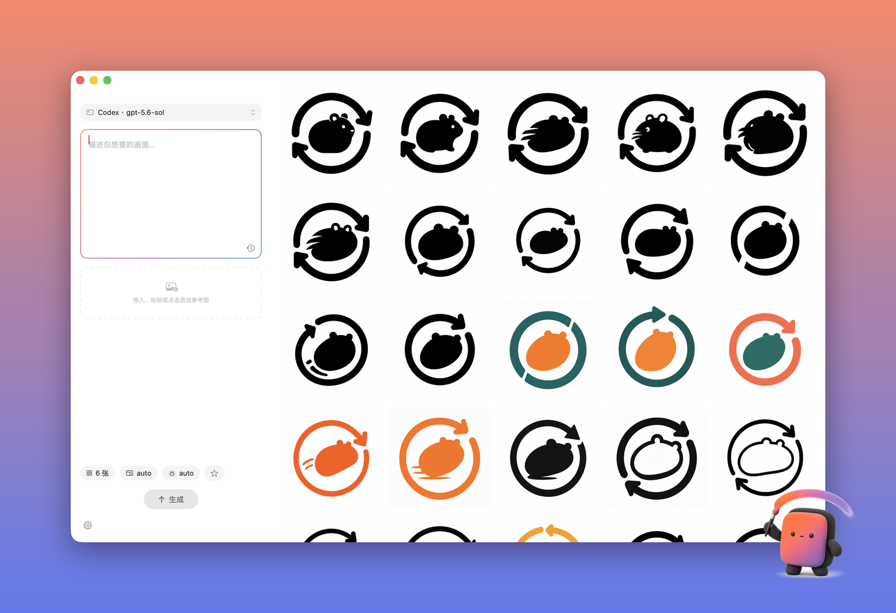

# Image Studio

[English](README.md) | 简体中文

macOS 原生 AI 图片工作台。写 prompt、丢参考图、一次并行出一批；结果落盘到自选目录，目录即历史。




## 为什么

多数出图工具要么开浏览器标签页，要么再买一份订阅。Image Studio 是一个 2.4 MB、零第三方依赖的原生 App，直接用你手上已有的后端：

- **Codex 通道**：复用本机 `codex login` 登录态（ChatGPT 订阅），不用额外 key，不产生额外费用
- **中转通道**：填一个 API Key 即可接任意 OpenAI Images 兼容中转。已实测 [right.codes](https://www.right.codes)（`gpt-image-2`、`nano-banana` 系列），同步与异步（任务轮询）中转都支持

## 功能

- 无限并行生成：一路请求一张图，每个槽位独立重试
- 目录即历史画廊：空格 Quick Look、拖出到 Finder、右键"用作参考图"一键迭代
- 收藏提示词（内置 Logo 画板模板）+ 自动提示词历史
- 参考图最多 16 张：拖入、粘贴（⇧⌘V）或文件选择
- 尺寸选项按通道对齐后端真实支持（实测验证，不放假选项）
- 中转模型列表带单价，生成前显示预估费用
- 中英双语界面

## 安装

从源码构建（需要 macOS 15+ 与 Xcode 16+）：

```bash
git clone git@github.com:Suge8/Image-Studio.git
cd Image-Studio
make install    # Release 构建并安装到 ~/Applications
make run
```

## 配置

两个通道选一个用，或都配好后从左上角胶囊随时切换：

**Codex**：终端跑一次 `codex login`（选 ChatGPT）。App 只读 `~/.codex/auth.json`，凭据不写往任何其他地方。

**中转**：设置 → 第三方中转，填 Base URL 和 API Key，点"保存并检测"，模型列表和价格自动拉取。Key 存 macOS Keychain。

## 使用

1. 写 prompt，或从收藏 chip 里挑一个
2. 参数 chips 调张数 / 尺寸 / 画质
3. ⌘↩ 生成，槽位完成一张进一张画廊
4. 迭代：右键任意结果 →"用作参考图"

尺寸语义按通道不同：Codex 端点只认 4 个值（auto、1:1、3:2、2:3）；中转接受比例（精确）+ 1K/2K/4K 档位（近似，视模型而定）。UI 只显示各后端真实接受的选项。

## 开发

```bash
make test       # 单元测试
make build      # Release 构建 → build/
make package    # 打包 zip → dist/
```

文档在 [`docs/`](docs/)：产品边界、架构、设计系统。从 [`AGENTS.md`](AGENTS.md) 开始看。

## 贡献

见 [CONTRIBUTING.md](.github/CONTRIBUTING.md)；安全问题报告见 [SECURITY.md](.github/SECURITY.md)。

## 许可

[Apache-2.0](LICENSE)
